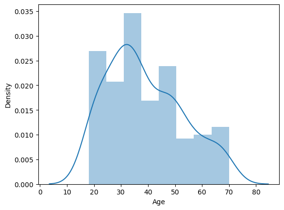

```python
import pandas as pd
import seaborn as sns
import matplotlib.pyplot as plt
from sklearn.cluster import KMeans
```


```python
df = pd.read_csv('./data/Mall_Customers.csv')
                 
df.head()
```


<div>
<table border="1" class="dataframe">
  <thead>
    <tr style="text-align: right;">
      <th></th>
      <th>CustomerID</th>
      <th>Gender</th>
      <th>Age</th>
      <th>Annual Income (k$)</th>
      <th>Spending Score (1-100)</th>
    </tr>
  </thead>
  <tbody>
    <tr>
      <th>0</th>
      <td>1</td>
      <td>Male</td>
      <td>19</td>
      <td>15</td>
      <td>39</td>
    </tr>
    <tr>
      <th>1</th>
      <td>2</td>
      <td>Male</td>
      <td>21</td>
      <td>15</td>
      <td>81</td>
    </tr>
    <tr>
      <th>2</th>
      <td>3</td>
      <td>Female</td>
      <td>20</td>
      <td>16</td>
      <td>6</td>
    </tr>
    <tr>
      <th>3</th>
      <td>4</td>
      <td>Female</td>
      <td>23</td>
      <td>16</td>
      <td>77</td>
    </tr>
    <tr>
      <th>4</th>
      <td>5</td>
      <td>Female</td>
      <td>31</td>
      <td>17</td>
      <td>40</td>
    </tr>
  </tbody>
</table>
</div>


# Analysis


```python
df.describe()
```


<div>
<table border="1" class="dataframe">
  <thead>
    <tr style="text-align: right;">
      <th></th>
      <th>CustomerID</th>
      <th>Age</th>
      <th>Annual Income (k$)</th>
      <th>Spending Score (1-100)</th>
    </tr>
  </thead>
  <tbody>
    <tr>
      <th>count</th>
      <td>200.000000</td>
      <td>200.000000</td>
      <td>200.000000</td>
      <td>200.000000</td>
    </tr>
    <tr>
      <th>mean</th>
      <td>100.500000</td>
      <td>38.850000</td>
      <td>60.560000</td>
      <td>50.200000</td>
    </tr>
    <tr>
      <th>std</th>
      <td>57.879185</td>
      <td>13.969007</td>
      <td>26.264721</td>
      <td>25.823522</td>
    </tr>
    <tr>
      <th>min</th>
      <td>1.000000</td>
      <td>18.000000</td>
      <td>15.000000</td>
      <td>1.000000</td>
    </tr>
    <tr>
      <th>25%</th>
      <td>50.750000</td>
      <td>28.750000</td>
      <td>41.500000</td>
      <td>34.750000</td>
    </tr>
    <tr>
      <th>50%</th>
      <td>100.500000</td>
      <td>36.000000</td>
      <td>61.500000</td>
      <td>50.000000</td>
    </tr>
    <tr>
      <th>75%</th>
      <td>150.250000</td>
      <td>49.000000</td>
      <td>78.000000</td>
      <td>73.000000</td>
    </tr>
    <tr>
      <th>max</th>
      <td>200.000000</td>
      <td>70.000000</td>
      <td>137.000000</td>
      <td>99.000000</td>
    </tr>
  </tbody>
</table>
</div>


```python
sns.distplot(df["Annual Income (k$)"])
```

    

    


```python
columns = ['Age', 'Annual Income (k$)', 'Spending Score (1-100)']

for column in columns:
    plt.figure()
    sns.distplot(df[column])
```

    

    


    

    


    

    


```python
sns.kdeplot(
    data=df,
    x=df["Annual Income (k$)"], 
    fill=True,
    hue=df["Gender"]
)
```

    

    


```python
columns = ['Age', 'Annual Income (k$)', 'Spending Score (1-100)']

for column in columns:
    plt.figure()
    sns.boxplot(
        data=df,
        x="Gender", 
        y=df[column],
    )
```


    

    


    

    


    

    


```python
df["Gender"].value_counts(normalize=True)
```


    Gender
    Female    0.56
    Male      0.44
    Name: proportion, dtype: float64


# 2)


```python
df.columns
```


    Index(['CustomerID', 'Gender', 'Age', 'Annual Income (k$)',
           'Spending Score (1-100)'],
          dtype='object')


```python
sns.scatterplot(df, x="Annual Income (k$)", y="Spending Score (1-100)")
```


    <Axes: xlabel='Annual Income (k$)', ylabel='Spending Score (1-100)'>


    

    


```python
# df.drop("CustomerID", axis=1, inplace=True)
sns.pairplot(df, hue="Gender")
```
    

    


```python
df.groupby(["Gender"]).mean()
```


<div>
<table border="1" class="dataframe">
  <thead>
    <tr style="text-align: right;">
      <th></th>
      <th>Age</th>
      <th>Annual Income (k$)</th>
      <th>Spending Score (1-100)</th>
    </tr>
    <tr>
      <th>Gender</th>
      <th></th>
      <th></th>
      <th></th>
    </tr>
  </thead>
  <tbody>
    <tr>
      <th>Female</th>
      <td>38.098214</td>
      <td>59.250000</td>
      <td>51.526786</td>
    </tr>
    <tr>
      <th>Male</th>
      <td>39.806818</td>
      <td>62.227273</td>
      <td>48.511364</td>
    </tr>
  </tbody>
</table>
</div>


```python
df.corr(numeric_only=True)
```


<div>
<table border="1" class="dataframe">
  <thead>
    <tr style="text-align: right;">
      <th></th>
      <th>Age</th>
      <th>Annual Income (k$)</th>
      <th>Spending Score (1-100)</th>
    </tr>
  </thead>
  <tbody>
    <tr>
      <th>Age</th>
      <td>1.000000</td>
      <td>-0.012398</td>
      <td>-0.327227</td>
    </tr>
    <tr>
      <th>Annual Income (k$)</th>
      <td>-0.012398</td>
      <td>1.000000</td>
      <td>0.009903</td>
    </tr>
    <tr>
      <th>Spending Score (1-100)</th>
      <td>-0.327227</td>
      <td>0.009903</td>
      <td>1.000000</td>
    </tr>
  </tbody>
</table>
</div>


```python
sns.heatmap(df.corr(numeric_only=True), annot=True)
```


    <Axes: >


    

    


## Clustering


```python
clustering1 = KMeans(n_clusters=3)
```


```python
clustering1.fit(df[["Annual Income (k$)"]])
```


```python
df["Income Cluster"] = clustering1.labels_
df.head()
```


<div>
<table border="1" class="dataframe">
  <thead>
    <tr style="text-align: right;">
      <th></th>
      <th>Gender</th>
      <th>Age</th>
      <th>Annual Income (k$)</th>
      <th>Spending Score (1-100)</th>
      <th>Income Cluster</th>
    </tr>
  </thead>
  <tbody>
    <tr>
      <th>0</th>
      <td>Male</td>
      <td>19</td>
      <td>15</td>
      <td>39</td>
      <td>1</td>
    </tr>
    <tr>
      <th>1</th>
      <td>Male</td>
      <td>21</td>
      <td>15</td>
      <td>81</td>
      <td>1</td>
    </tr>
    <tr>
      <th>2</th>
      <td>Female</td>
      <td>20</td>
      <td>16</td>
      <td>6</td>
      <td>1</td>
    </tr>
    <tr>
      <th>3</th>
      <td>Female</td>
      <td>23</td>
      <td>16</td>
      <td>77</td>
      <td>1</td>
    </tr>
    <tr>
      <th>4</th>
      <td>Female</td>
      <td>31</td>
      <td>17</td>
      <td>40</td>
      <td>1</td>
    </tr>
  </tbody>
</table>
</div>


```python
df["Income Cluster"].value_counts()
```


    Income Cluster
    0    92
    1    72
    2    36
    Name: count, dtype: int64


```python
clustering1.inertia_
```


    23528.152173913044


```python
inertia_scores = []
for i in range(1,11):
    kmeans = KMeans(n_clusters=i)
    kmeans.fit(df[["Annual Income (k$)"]])
    inertia_scores.append(kmeans.inertia_)
```


```python
plt.plot(range(1,11), inertia_scores)
```


    [<matplotlib.lines.Line2D at 0x239b08d2cd0>]


    

    


```python
df.columns
```


    Index(['Gender', 'Age', 'Annual Income (k$)', 'Spending Score (1-100)',
           'Income Cluster'],
          dtype='object')


```python
df.groupby("Income Cluster")[['Age', 'Annual Income (k$)', 'Spending Score (1-100)']] \
    .mean()
```


<div>
<table border="1" class="dataframe">
  <thead>
    <tr style="text-align: right;">
      <th></th>
      <th>Age</th>
      <th>Annual Income (k$)</th>
      <th>Spending Score (1-100)</th>
    </tr>
    <tr>
      <th>Income Cluster</th>
      <th></th>
      <th></th>
      <th></th>
    </tr>
  </thead>
  <tbody>
    <tr>
      <th>0</th>
      <td>39.184783</td>
      <td>66.717391</td>
      <td>50.054348</td>
    </tr>
    <tr>
      <th>1</th>
      <td>38.930556</td>
      <td>33.027778</td>
      <td>50.166667</td>
    </tr>
    <tr>
      <th>2</th>
      <td>37.833333</td>
      <td>99.888889</td>
      <td>50.638889</td>
    </tr>
  </tbody>
</table>
</div>


## II Clustering


```python
inertia_scores2 = []
for i in range(1,11):
    kmeans2 = KMeans(n_clusters=i)
    kmeans2.fit(df[["Annual Income (k$)", "Spending Score (1-100)"]])
    inertia_scores2.append(kmeans2.inertia_)

plt.plot(range(1,11), inertia_scores2)
```


    

    


```python
clustering2 = KMeans(n_clusters=5)
clustering2.fit(df[['Annual Income (k$)', 'Spending Score (1-100)']])
df["Spending and Income Cluster"] = clustering2.labels_
```


```python
centers = pd.DataFrame(clustering2.cluster_centers_)
centers.columns = ["x", "y"]
centers
```


<div>
<table border="1" class="dataframe">
  <thead>
    <tr style="text-align: right;">
      <th></th>
      <th>x</th>
      <th>y</th>
    </tr>
  </thead>
  <tbody>
    <tr>
      <th>0</th>
      <td>55.296296</td>
      <td>49.518519</td>
    </tr>
    <tr>
      <th>1</th>
      <td>88.200000</td>
      <td>17.114286</td>
    </tr>
    <tr>
      <th>2</th>
      <td>86.538462</td>
      <td>82.128205</td>
    </tr>
    <tr>
      <th>3</th>
      <td>25.727273</td>
      <td>79.363636</td>
    </tr>
    <tr>
      <th>4</th>
      <td>26.304348</td>
      <td>20.913043</td>
    </tr>
  </tbody>
</table>
</div>


```python
plt.figure(figsize=(10,8))
plt.scatter(x=centers["x"], y=centers["y"], s=100, c="black", marker="*")
sns.scatterplot(
    data=df, 
    x="Annual Income (k$)", 
    y="Spending Score (1-100)",
    hue="Spending and Income Cluster",
    palette="tab10"
)
```

    

    


```python
df.groupby('Spending and Income Cluster') \
    [['Age', 'Annual Income (k$)', 'Spending Score (1-100)']] \
    .mean()
```


<div>
<table border="1" class="dataframe">
  <thead>
    <tr style="text-align: right;">
      <th></th>
      <th>Age</th>
      <th>Annual Income (k$)</th>
      <th>Spending Score (1-100)</th>
    </tr>
    <tr>
      <th>Spending and Income Cluster</th>
      <th></th>
      <th></th>
      <th></th>
    </tr>
  </thead>
  <tbody>
    <tr>
      <th>0</th>
      <td>42.716049</td>
      <td>55.296296</td>
      <td>49.518519</td>
    </tr>
    <tr>
      <th>1</th>
      <td>41.114286</td>
      <td>88.200000</td>
      <td>17.114286</td>
    </tr>
    <tr>
      <th>2</th>
      <td>32.692308</td>
      <td>86.538462</td>
      <td>82.128205</td>
    </tr>
    <tr>
      <th>3</th>
      <td>25.272727</td>
      <td>25.727273</td>
      <td>79.363636</td>
    </tr>
    <tr>
      <th>4</th>
      <td>45.217391</td>
      <td>26.304348</td>
      <td>20.913043</td>
    </tr>
  </tbody>
</table>
</div>


